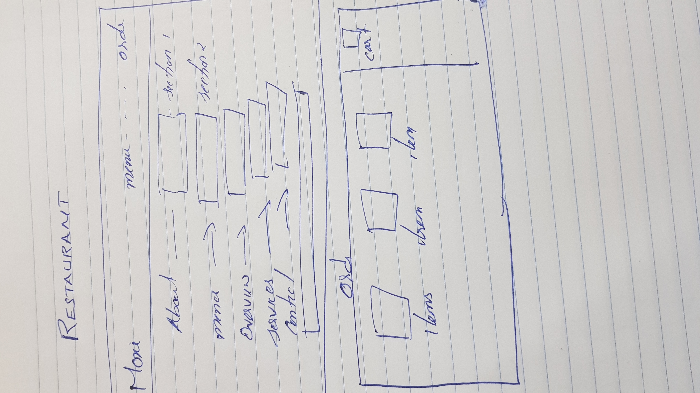

# MOXIE BAR AND GRILL
   ## UX ##
* This website is for Users who wish to order food and the services provided.
* This website gives them an idea about the menu price location and what other services they are provided like indoor party wedding etc.
* We provide online ordering options so the customers need not wait until the food has been prepared
### USER STORIES ###
* As an admin i wish to give a userfriendly restaurant website.
* As a user i can see the food menu.
* As a User i can get information about the services they provided.
*  As a user i can explore the various location using the google map and if any queries there is an contact form so i can communicate the restaurant authorities.
 * As a user i can  preorder my food need not have to wait for takeout.
 
 #### WIREFRAMES ####
 

## FEATURES ##
In this section, you should go over the different parts of your project, and describe each in a sentence or so.
### Existing Features ###
* Application for homepage.
* Navigation to menu page.
* Navigation to services page.
* Navigation to gallery page.
* Navigation to Contact page.
* Navigation  link to order webpages.
* Direction Map using Google Map API.
* Animation using javascript
* Provided Contact Us form.
* Provide email facility using Email.js
* Using Jquery add online order and bt each order it will added to the cart and the no is incremented

### Features Left to Implement ###
* Options to provide customer reviews about restaurant.
* Add table reservation
* Application fpr home delivery.

 
 ## Technologies Used ##
 * **HTML** is used for the creation of webpage.
 * **CSS** is used for website design and Styling.
 * **API** is used for Providing Google Map,Email Rechapche
  * **Javascript** is used for Animation and popup box when send email
   * **jquery** is used for online ordering.
 * **Font Awesome** is used for taking icons.
 * **BOOTSRAP 4** to have reusable CSS styling.
 
 ## TESTING ##
 * All the html and css code has been tested in **w3c validator**.
 * Test has been done to verify all the href links are working properly.
 * Test was done for animation is working properly.
 * Test has been done if the form is working properly.
 * Test has been done to ensure email is received using email.js.
 * Test has been done to ensure proper working of location map using Api.
 * Test has been done to ensure proper working of jquery for online ordering.
 
 ### Project looks and screen sizes ###
 
* The website is designed with bootstrap hence mobile friendly by default.
* Different Screen sizes are available for different devices
  eg: ipad pro: 1024 x 1336
  
## Deployment ##

The project was performed  using gitpod application which includes the various aspects of webpage creation like page development, page designing.After the webpage creation in gitpod the project  is pushed to GitHub usingvarious commants like add commit and push .After Linking with Github the project code is connected to GitHub from gitpod.Finaly the project was deployed to GitHub hosting platform.

## Credits ##

### Content ###

* The text for index section was copied from moxie website
* 
## Media ##
* The photos used in this site were obtained from google images related to restaurants.

## Acknowledgement ##
* I received inspiration for this project from various restaurant page.
